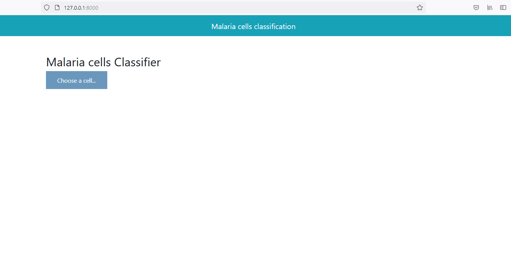

# Malaria cells detector

## Aim
This project aims to detect malaria in liver cells. It classifies whether a cell is infected with malaria or not.

## How to use
- Clone the repository 

- Install the required packages in "requirements.txt" file by running: *pip install -r requirements.txt*

- Run the "app.py" file using the command  *uvicorn app:app --reload* and the App is ready to be browsed on your localhost.

## Description

### What this App does?
This app takes a liver cell as input.  It then predicts whether the cell is infected with malaria or not. For example, the figure below shows the predicted disease of the selected liver cells.

### How this Project has been realized?
- First, the data were collected from Kaggle (https://www.kaggle.com/datasets/iarunava/cell-images-for-detecting-malaria?resource=download).

- Then they have been split into Training, Validation and Test sets. 

- The data were resized and rescaled, and some data augmentation techniques (e.g., rotation) were applied to the training and validation sets.

- A popular pre-trained model (VGG-19) has been used and transfer learning was applied to adapt this model to the present data. The model achieved an accuracy of 92%

- Link for notebook:  [Malaria detector](https://github.com/DanielleOriane/Data_science_projects/blob/master/malaria_detector.ipynb)

- This project was given the form of an website built on FastAPI (See [app.py](https://github.com/DanielleOriane/Data_science_projects/blob/master/app.py) file) where the trained model has been used to perform the predictions.

